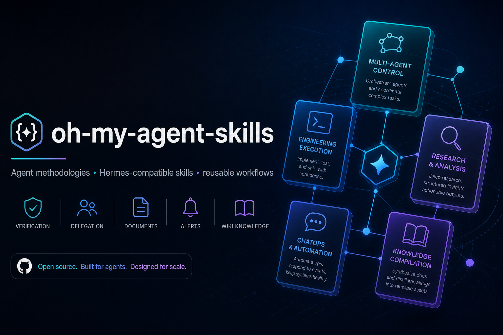

# oh-my-agent-skills

Languages: [English](README.md) | [简体中文](README.zh-CN.md)

[](https://github.com/xiaohei-info/oh-my-agent-skills/releases)
[](LICENSE)
[](https://github.com/xiaohei-info/oh-my-agent-skills/commits/main)

**Installable agent skills and workflow patterns for common failures in AI systems.**

Use this repository when you want to make an agent more reliable without rebuilding your whole stack. You can adopt **one skill**, **one bundle**, or the **full pack** depending on the problem you want to fix.

It is especially useful for teams and operators who need stronger execution discipline, cleaner subagent delegation, better chat-native automation outputs, more reusable skills, and more maintainable knowledge workflows.



## What problems this repo helps fix

Start here if your agent or workflow has one of these failure modes:

- it says “done” without proof
- debugging turns into guess-and-check
- subagents drift, overlap, or need tighter controller discipline
- cron / alert messages are technically correct but painful to read in chat
- research quality varies because tool choice is inconsistent
- notes pile up, but never become a durable compiled knowledge layer

## Start small: one skill, one bundle, or the full pack

You do **not** need to install everything.

- **One skill** — fix one sharp problem fast
  - Example: `verification-before-completion`
- **One bundle** — improve one class of workflows
  - Example: `engineering-execution/`
- **Full pack** — curate a broader Hermes-compatible skill library

The repository is intentionally modular so you can mix and match only what your runtime and team actually need.

## Good first picks by need

### If your agent claims success too early
Start with:
- `engineering-execution/verification-before-completion`
- `engineering-execution/systematic-debugging`

### If multi-agent delegation gets messy
Start with:
- `multi-agent-control/subagent-first`
- `multi-agent-control/subagent-collaboration-workflow`

### If cron or monitoring messages are unreadable in chat
Start with:
- `chatops-and-ops/user-friendly-cron-messages`
- `chatops-and-ops/ops-sentry`

### If you want better reusable skill packaging
Start with:
- `skill-engineering/writing-skills`
- `skill-engineering/external-hermes-skills-lifecycle`
- `skill-engineering/skill-optimizer`

### If you need stronger research or knowledge workflows
Start with:
- `research-and-reading/web-reading-router`
- `research-and-reading/hv-analysis`
- `knowledge-compilation/*`

## Quick install for Hermes

### 1. Clone the repo

```bash
git clone https://github.com/xiaohei-info/oh-my-agent-skills.git
cd oh-my-agent-skills
```

### 2. Copy one skill into your Hermes skill library

Example: install `verification-before-completion` only.

```bash
mkdir -p ~/.hermes/skills/software-development
cp -R skills/engineering-execution/verification-before-completion \
  ~/.hermes/skills/software-development/
```

### 3. Or copy one full bundle when the destination category is shared

Example: install the whole `engineering-execution` bundle.

```bash
mkdir -p ~/.hermes/skills/software-development
cp -R skills/engineering-execution/verification-before-completion \
  ~/.hermes/skills/software-development/
cp -R skills/engineering-execution/systematic-debugging \
  ~/.hermes/skills/software-development/
```

### 4. Use the source map for mixed-category bundles

Public bundle folders are organized for browsing. Hermes install paths follow the skill's original category.

Use [`docs/source-map.md`](docs/source-map.md) when you install bundles such as:
- `multi-agent-control/`
- `skill-engineering/`
- `knowledge-compilation/`

### 5. Preserve support files

Always copy the whole skill directory, not only `SKILL.md`.

That means preserving any bundled:
- `references/`
- `templates/`
- `scripts/`
- `assets/`

## How to use these skills after install

Once a skill is installed, call it deliberately in the task prompt.

Examples:
- “Use `verification-before-completion` before telling me this bug is fixed.”
- “Use `subagent-first` to plan and delegate this feature.”
- “Use `user-friendly-cron-messages` to rewrite this monitoring output for Telegram.”
- “Use `web-reading-router` to choose the lightest reliable way to read this URL set.”

## Use it even if you are not on Hermes

Many skills are Hermes-native in syntax, but still portable in method.

Typical translations:
- `delegate_task` -> your child-agent / worker abstraction
- `read_file/search_files/patch/write_file` -> your codebase tooling
- `clarify` -> your user-interaction layer
- `todo` -> your task planner or state tracker

See [`docs/portability-notes.md`](docs/portability-notes.md) before adapting skills into another runtime.

## Repository layout

```text
skills/
  engineering-execution/
  multi-agent-control/
  skill-engineering/
  chatops-and-ops/
  research-and-reading/
  knowledge-compilation/

docs/
  adoption-guide.md
  bundles.md
  portability-notes.md
  social-preview.md
  source-map.md

assets/
  social-preview.png
```

## Bundle overview

- **engineering-execution** — verification and debugging discipline
- **multi-agent-control** — controller-side delegation patterns
- **skill-engineering** — authoring, packaging, and improving reusable skills
- **chatops-and-ops** — human-readable recurring automation and monitoring
- **research-and-reading** — tool-routing and deep-analysis workflows
- **knowledge-compilation** — inbox-to-wiki and compiled-knowledge maintenance

For a bundle-by-bundle guide, see [`docs/bundles.md`](docs/bundles.md).

## Who this repo is for

This repository is useful if you are:
- building an AI agent runtime
- curating a reusable skill library
- trying to make multi-agent workflows less sloppy
- packaging prompt / method assets for public reuse
- designing chat-native cron or alerting systems
- maintaining an Obsidian-style compiled knowledge base

## Why these skills are different

The strongest ideas in this repo are:
- **evidence-first completion** instead of vague success claims
- **root-cause debugging** instead of random fixes
- **controller-style delegation** instead of unbounded agent swarms
- **human-readable automation output** instead of internal dumps
- **compiled knowledge maintenance** instead of raw note accumulation
- **reusable skill packaging** instead of one-off prompts

## Recommended reading path

1. Pick the problem you want to fix.
2. Install one skill or one bundle.
3. Read [`docs/adoption-guide.md`](docs/adoption-guide.md) for a deeper rollout path.
4. Read [`docs/portability-notes.md`](docs/portability-notes.md) if you are adapting outside Hermes.
5. Read the chosen skill's `SKILL.md` and support files before relying on it in production.

## Related docs

- [`AGENTS.md`](AGENTS.md) — repository working rules for agent collaborators
- [`docs/adoption-guide.md`](docs/adoption-guide.md) — modular adoption paths and install guidance
- [`docs/bundles.md`](docs/bundles.md) — bundle-by-bundle problem/skill guide
- [`docs/portability-notes.md`](docs/portability-notes.md) — what is Hermes-native vs portable
- [`docs/social-preview.md`](docs/social-preview.md) — social preview asset notes
- [`docs/source-map.md`](docs/source-map.md) — public bundle to original Hermes category mapping
- [`SECURITY.md`](SECURITY.md) — how to report security-sensitive issues
- [`CODE_OF_CONDUCT.md`](CODE_OF_CONDUCT.md) — participation expectations

## Contributing

See [`CONTRIBUTING.md`](CONTRIBUTING.md).

## License

MIT
